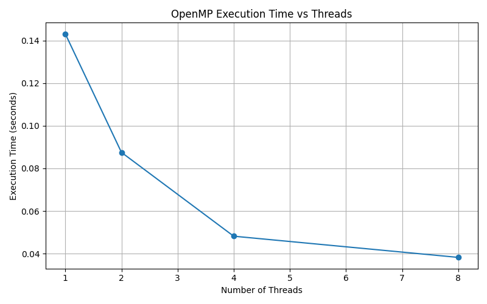

## 🚀 Quick Start (End-to-End Pipeline)

Run these commands from the project root.

### Create Python virtual environment (first time only)

```bash
python3 -m venv hpc_env
source hpc_env/bin/activate
python3 -m pip install --upgrade pip
pip install numpy opencv-python matplotlib
```

```bash
# 1) Activate Python environment
source hpc_env/bin/activate

# 2) Preprocess input image (creates grayscale + resized input for C code)
python3 scripts/preprocessing/input_image_processing.py

# 3) Compile implementations - Serial Code

mkdir -p build
gcc -O2 -std=c11 src/serial/hist_eq_serial.c -o build/hist_eq_serial

## 3.1 ) Run implementations
./build/hist_eq_serial results/pgm/input.pgm results/pgm/output_serial.pgm

## 3.2) Open results for visual check (optional)
eog output/output_openmp.pgm

# 4) Compile implementations - Openmp Code

 gcc -O2 -fopenmp -std=c11 src/openmp/hist_eq_openmp.c -o build/hist_eq_openmp

## 4.1 ) Run implementations
./build/hist_eq_openmp results/pgm/input.pgm results/pgm/output_openmp.pgm

## 4.2) Open results for visual check (optional)
eog output/output_openmp.pgm

## 4.3) Generate performance plot (OpenMP)
python3 scripts/visualization/plot_openmp_result.py

# 5) Compile implementations - MPI Code

    mpicc -O2 -std=c11 src/mpi/hist_eq_mpi.c -o build/hist_eq_mpi

## 5.1 ) Run implementations
    mpirun -np 1 ./build/hist_eq_mpi results/pgm/input.pgm results/pgm/output_mpi.pgm

## 5.2) Open results for visual check (optional)
eog output/output_mpi.pgm

## 5.3) Generate performance plot (MPI)
python3 scripts/visualization/plot_mpi_result.py
```

---

## Parallel Histogram Equalization (OpenMP) ⚡️🖼️

This project implements **histogram equalization** for grayscale images and accelerates the heavy computations using **OpenMP** (shared-memory parallelism) 🚀.

---

## 📁 Folder Structure (OpenMP-related)

- `src/openmp/`
  - `hist_eq_openmp.c` — OpenMP implementation 🧵
- `data/`
  - `input_image.png` — sample input image 🖼️
- `results/plots/`
  - `openmp_execution_time_plot.png` — performance plot (execution time) 📈

---

## 🧠 What is OpenMP?

**OpenMP (Open Multi-Processing)** is an API for parallel programming on **shared-memory** systems (multi-core CPUs).  
In this project, OpenMP helps speed up key steps such as:

- building the **histogram** (counts per intensity) 🧮  
- computing the **CDF** (cumulative distribution function) 📊  
- transforming pixel values across the full image ✅  

Parallelism is typically introduced with directives like:

- `#pragma omp parallel`
- `#pragma omp for`
- `reduction(...)` / atomic updates (depending on the approach)

---

## 🛠️ Compile (OpenMP)

Using **GCC**:

```bash
gcc -O3 -fopenmp -o hist_eq_openmp src/openmp/hist_eq_openmp.c -lm
```

---

## ▶️ Run

Example (adjust depending on how your program accepts input):

```bash
./hist_eq_openmp
```

If your program takes an image path:

```bash
./hist_eq_openmp data/input_image.png
```

---

## 📈 Results (Performance Plot)

OpenMP execution-time results:



---

## 💡 Tips

- You can control the number of threads like this:
  ```bash
  export OMP_NUM_THREADS=4
  ./hist_eq_openmp
  ```
- Performance scaling depends on CPU cores, memory bandwidth, and image size ⚙️
