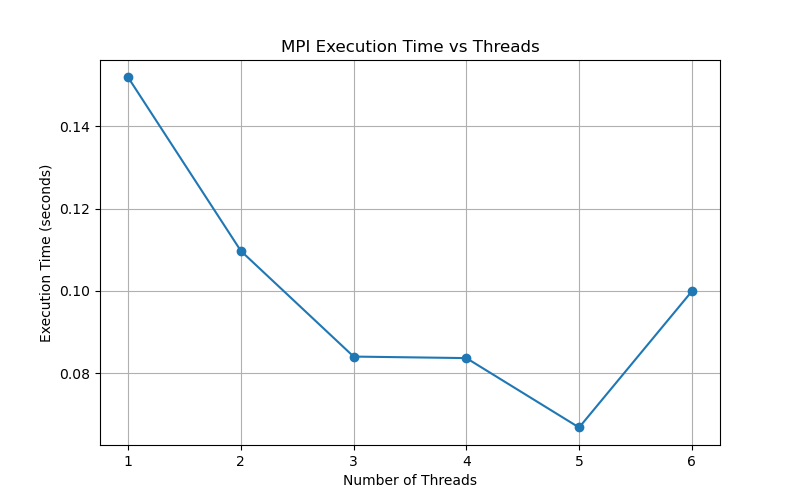
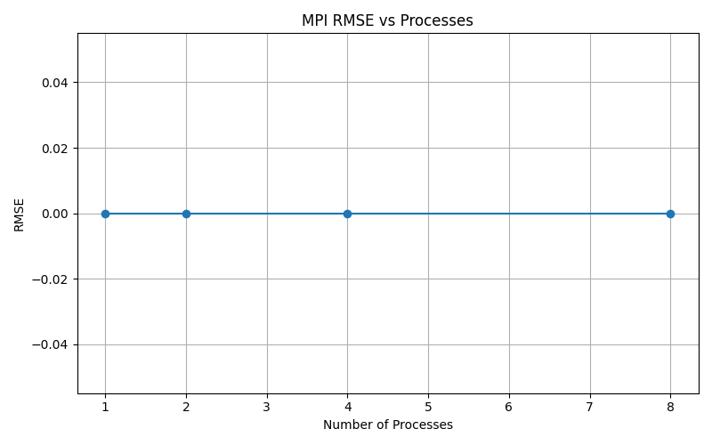

## 🚀 Quick Start (End-to-End Pipeline)

Run these commands from the project root.

### Create Python virtual environment (first time only)

```bash
python3 -m venv hpc_env
source hpc_env/bin/activate
python3 -m pip install --upgrade pip
pip install numpy opencv-python matplotlib
```

```bash
# 1) Activate Python environment
source hpc_env/bin/activate

# 2) Preprocess input image (creates grayscale + resized input for C code)
python3 scripts/preprocessing/input_image_processing.py

# 3) Compile implementations - Serial Code

mkdir -p build
gcc -O2 -std=c11 src/serial/hist_eq_serial.c -o build/hist_eq_serial

## 3.1 ) Run implementations
./build/hist_eq_serial results/pgm/input.pgm results/pgm/output_serial.pgm

## 3.2) Open results for visual check (optional)
# eog output/output_openmp.pgm
/usr/bin/eog results/pgm/output_openmp.pgm

# 4) Compile implementations - Openmp Code

 gcc -O2 -fopenmp -std=c11 src/openmp/hist_eq_openmp.c -o build/hist_eq_openmp

## 4.1 ) Run implementations
./build/hist_eq_openmp results/pgm/input.pgm results/pgm/output_openmp.pgm

## 4.2) Open results for visual check (optional)
eog output/output_openmp.pgm

## 4.3) Generate performance plot (OpenMP)
python3 scripts/visualization/plot_openmp_result.py

# 5) Compile implementations - MPI Code

    mpicc -O2 -std=c11 src/mpi/hist_eq_mpi.c -o build/hist_eq_mpi

## 5.1 ) Run implementations
    mpirun -np 1 ./build/hist_eq_mpi results/pgm/input.pgm results/pgm/output_mpi.pgm
    mpirun -np 2 ./build/hist_eq_mpi results/pgm/input.pgm results/pgm/output_mpi.pgm
    mpirun -np 3 ./build/hist_eq_mpi results/pgm/input.pgm results/pgm/output_mpi.pgm
    mpirun -np 4 ./build/hist_eq_mpi results/pgm/input.pgm results/pgm/output_mpi.pgm
    mpirun -np 5 ./build/hist_eq_mpi results/pgm/input.pgm results/pgm/output_mpi.pgm
    mpirun -np 6 ./build/hist_eq_mpi results/pgm/input.pgm results/pgm/output_mpi.pgm

## 5.2) Open results for visual check (optional)
eog output/output_mpi.pgm

## 5.3) Generate performance plot (MPI)
python3 scripts/visualization/plot_mpi_result.py

## 6) Compile implementations - Hybrid CUDA + MPI Code

mkdir -p build
nvcc -O2 -std=c++11 \
  "src/hybrid(MPI+CUDA)/hist_eq_cuda_mpi.cu" \
  -I/usr/lib/x86_64-linux-gnu/openmpi/include \
  -L/usr/lib/x86_64-linux-gnu/openmpi/lib \
  -lmpi \
  -o build/hist_eq_cuda_mpi

## 6.1) Run implementations
    mpirun -np 1 ./build/hist_eq_cuda_mpi results/pgm/input.pgm results/pgm/output_hybrid.pgm
    mpirun -np 2 ./build/hist_eq_cuda_mpi results/pgm/input.pgm results/pgm/output_hybrid.pgm
    mpirun -np 4 ./build/hist_eq_cuda_mpi results/pgm/input.pgm results/pgm/output_hybrid.pgm
    mpirun -np 6 ./build/hist_eq_cuda_mpi results/pgm/input.pgm results/pgm/output_hybrid.pgm

## 6.2) Open results for visual check (optional)
eog results/pgm/output_hybrid.pgm

## 6.3) Generate performance plot (Hybrid)
```bash
python3 scripts/visualization/plot_hybrid_result.py
python3 scripts/visualization/plot_hybrid_rmse.py
```

## 7) Comparison plots

```bash
# Speedup comparison — MPI-only vs OpenMP vs Hybrid on the same axes
python3 scripts/visualization/plot_hybrid_speedup.py

# RMSE comparison — MPI vs OpenMP vs Hybrid on the same axes
python3 scripts/visualization/plot_rmse_comparison.py
```

## Parallel Histogram Equalization (MPI) 🌐🖼️

This project implements **histogram equalization** for grayscale images using **MPI** so the image is split across processes and combined again after processing. Rank 0 reads the input image, distributes work with `MPI_Scatterv`, combines histograms with `MPI_Allreduce`, and gathers the final image with `MPI_Gatherv`.

---

## 📁 Folder Structure (MPI-related)

- `src/mpi/`
  - `hist_eq_mpi.c` — MPI implementation 📡
- `results/benchmarks/`
  - `mpi_execution_results.txt` — execution-time results
  - `mpi_rmse_results.txt` — RMSE results against the serial output
- `results/pgm/`
  - `output_mpi.pgm` — output image written by the MPI run
- `results/png/`
  - `04_output_mpi.png` — PNG copy created automatically after the run

---

## 🧠 How it works

### Algorithm overview

1. Rank 0 reads `results/pgm/input.pgm`.
2. The image is divided across ranks with `MPI_Scatterv`.
3. Each rank computes a local histogram for its chunk.
4. `MPI_Allreduce` combines all local histograms into one global histogram.
5. Rank 0 computes the CDF and look-up table (LUT).
6. Each rank remaps its local pixels through the LUT.
7. `MPI_Gatherv` collects the processed chunks back on rank 0.
8. Rank 0 writes `results/pgm/output_mpi.pgm` and updates the benchmark files.

### MPI calls used

- `MPI_Init` / `MPI_Finalize`
- `MPI_Comm_rank` / `MPI_Comm_size`
- `MPI_Bcast`
- `MPI_Scatterv`
- `MPI_Allreduce`
- `MPI_Gatherv`

---

## 🛠️ Compile (MPI)

Run from the **project root**:

```bash
mkdir -p build
mpicc -O2 -std=c11 src/mpi/hist_eq_mpi.c -o build/hist_eq_mpi
```

---

## ▶️ Run (MPI)

Run from the **project root**. Repeat for each process count to populate the benchmark files:

```bash
mpirun -np 1 ./build/hist_eq_mpi results/pgm/input.pgm results/pgm/output_mpi.pgm
mpirun -np 2 ./build/hist_eq_mpi results/pgm/input.pgm results/pgm/output_mpi.pgm
mpirun -np 3 ./build/hist_eq_mpi results/pgm/input.pgm results/pgm/output_mpi.pgm
mpirun -np 4 ./build/hist_eq_mpi results/pgm/input.pgm results/pgm/output_mpi.pgm
mpirun -np 5 ./build/hist_eq_mpi results/pgm/input.pgm results/pgm/output_mpi.pgm
mpirun -np 6 ./build/hist_eq_mpi results/pgm/input.pgm results/pgm/output_mpi.pgm
```

The program prints the elapsed time, writes `results/pgm/output_mpi.pgm`, appends to `results/benchmarks/mpi_execution_results.txt`, and records RMSE values in `results/benchmarks/mpi_rmse_results.txt` when the serial reference output is available.

---

## 📈 Results

MPI execution-time results:



MPI RMSE results:



The output image is also converted automatically to PNG at `results/png/04_output_mpi.png`.

---

## 💡 Tips

- If you want to regenerate the MPI plot, run:
  ```bash
  python3 scripts/visualization/plot_mpi_result.py
  ```
- RMSE is calculated against `results/pgm/output_serial.pgm`, so generate the serial output first.

---

## Parallel Histogram Equalization (OpenMP) ⚡️🖼️

This project implements **histogram equalization** for grayscale images and accelerates the heavy computations using **OpenMP** (shared-memory parallelism) 🚀.

---

## 📁 Folder Structure (OpenMP-related)

- `src/openmp/`
  - `hist_eq_openmp.c` — OpenMP implementation 🧵
- `data/`
  - `input_image.png` — sample input image 🖼️
- `results/plots/`
  - `openmp_execution_time_plot.png` — performance plot (execution time) 📈

---

## 🧠 What is OpenMP?

**OpenMP (Open Multi-Processing)** is an API for parallel programming on **shared-memory** systems (multi-core CPUs).  
In this project, OpenMP helps speed up key steps such as:

- building the **histogram** (counts per intensity) 🧮  
- computing the **CDF** (cumulative distribution function) 📊  
- transforming pixel values across the full image ✅  

Parallelism is typically introduced with directives like:

- `#pragma omp parallel`
- `#pragma omp for`
- `reduction(...)` / atomic updates (depending on the approach)

---

## 🛠️ Compile (OpenMP)

Using **GCC**:

```bash
gcc -O3 -fopenmp -o hist_eq_openmp src/openmp/hist_eq_openmp.c -lm
```

---

## ▶️ Run

Example (adjust depending on how your program accepts input):

```bash
./hist_eq_openmp
```

If your program takes an image path:

```bash
./hist_eq_openmp data/input_image.png
```

---

## 📈 Results (Performance Plot)

OpenMP execution-time results:


---

## 💡 Tips

- You can control the number of threads like this:
  ```bash
  export OMP_NUM_THREADS=4
  ./hist_eq_openmp
  ```
- Performance scaling depends on CPU cores, memory bandwidth, and image size ⚙️
